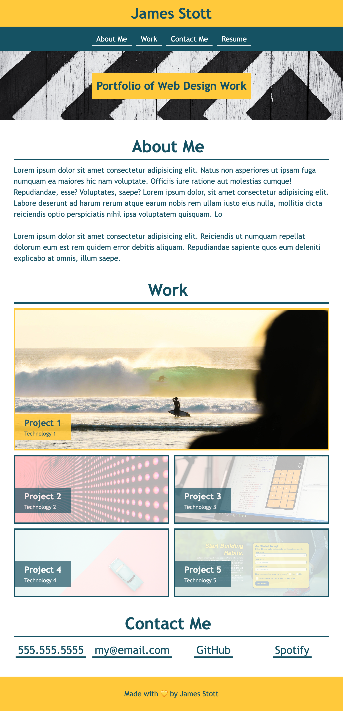

# James Stott's Portofilo Page

## Description
This is a portofilo page designed with web designed best principles at the forefront of any design decisions. The site uses semantic HTML elements where possible and achieves responsiveness and a clean and organised layout through the use of CSS flexbox and grid modules.

The site is designed with different device sizes in mind, with intuitive layouts automatically adjusting for devices of the following sizes:

* over 768px in width
* between 577px and 768px in width
* less than 577px in width

On hover effects are used to create interest and establish a strong sense of visual hierarchy to guide the user in navigating important parts of the portfolio.



## Installation

Please clone this repository with the following command in your terminal:

```
git clone https://github.com/jamesaps/james-stott-portfolio.git
```

## Usage
This site is designed to automatically deploy to github pages when changes are committed to the main branch.

## Credits
Starter code for this project was provided by edX Boot Camps LLC.

## License

Licensed under the [MIT](https://github.com/jamesaps/james-stott-portfolio/blob/main/LICENSE) license.

© 2023 James Stott. Confidential and Proprietary. All Rights Reserved.